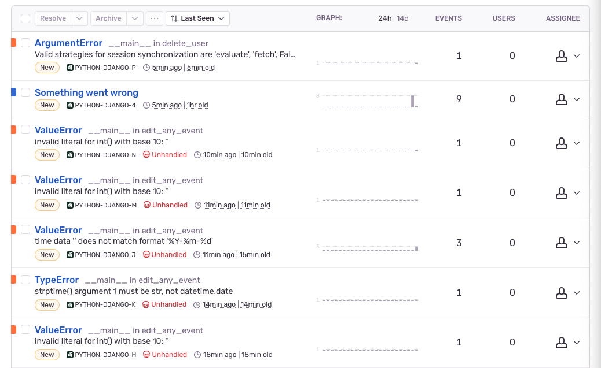

## Pré-requis

* Installer Python 3 : [Téléchargement Python 3](https://www.python.org/downloads/)
* Installer git : [Téléchargement Git](https://git-scm.com/book/fr/v2/D%C3%A9marrage-rapide-Installation-de-Git)

## Installation

### 1. Télécharger le projet sur votre répertoire local :
```
git clone https://github.com/OpenClassrooms-Student-Center/4425126-testing-python.git
cd 4425126-testing-python
```
### 2. Mettre en place un environnement virtuel :
* Créer l'environnement virtuel: `python -m venv venv`
* Activer l'environnement virtuel :
    * Windows : `venv\Scripts\activate.bat`
    * Unix/MacOS : `source venv/bin/activate`


### 3. Installer les dépendances du projet
```
pip install -r requirements.txt
```
### 4. Définir les variables d'environnement

.env file:
```
export DB="your-database-connection-string"
export SENTRY="your-sentry-connection-string"
```

add to .bashrc or .zshrc:
```
export DB="your-database-connection-string"
export SENTRY="your-sentry-connection-string"
```

## 5. Pour créer les tables et insérer les données dans la base de données
* Lancer le script à l'aide de la commande suivante :

Windows/Linux:
`python main.py`

MacOS:
`python3  main.py`

## Démarrage
* Lancer le script à l'aide de la commande suivante :

Windows/Linux:
`python crm.py`

MacOS:
`python3 crm.py`

## Couverture de test sentry

[View all issues](https://not-applicable-p0.sentry.io/issues/?project=4505981446782976)



